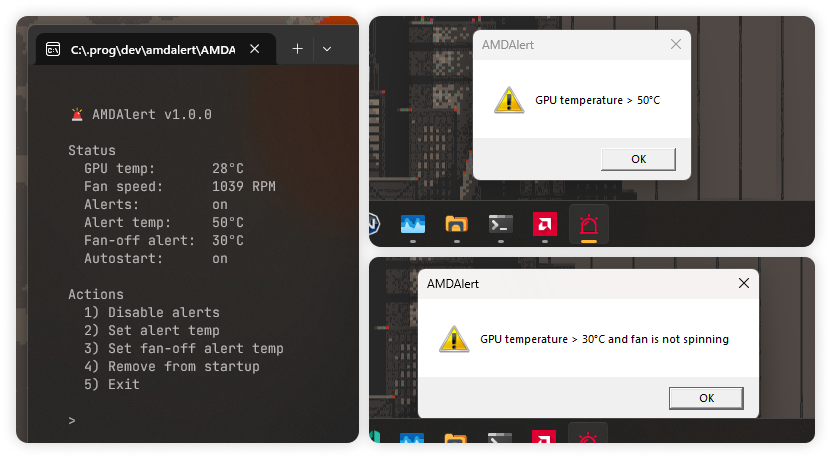

	
	 
	&nbsp;
	&nbsp;
	&nbsp;
	  
	A lightweight Windows utility that <b>alerts you when your AMD GPU overheats</b> Perfect for older cards like the RX 550 where the fan may silently stop 🫠
	  
	<b>
		<a href="#-features">Features</a>&nbsp; •&nbsp;
		<a href="#-installation">Installation</a>&nbsp; •&nbsp;
		<a href="#%EF%B8%8F-usage">Usage</a>
	</b>
	  
	

## 🔥 Features

- Monitors GPU state and triggers alerts on overheating
- Detects fan failures (zero RPM under load)
- Simple YAML configuration
- Launch at Windows startup

## 📥 Installation

Download and extract the [latest release](https://github.com/kh4f/amdalert/releases/latest).

## 🕹️ Usage

- Control the app from the command line with `AMDAlert.exe`.
- Configuration is stored in `config.yml` (created automatically on first run). You can edit it manually or via CLI сommands.
- Enabling alerts launches `AMDAlertDaemon.exe` in the background, that runs every 10 sec, reloading the config if updated and showing notifications when needed.